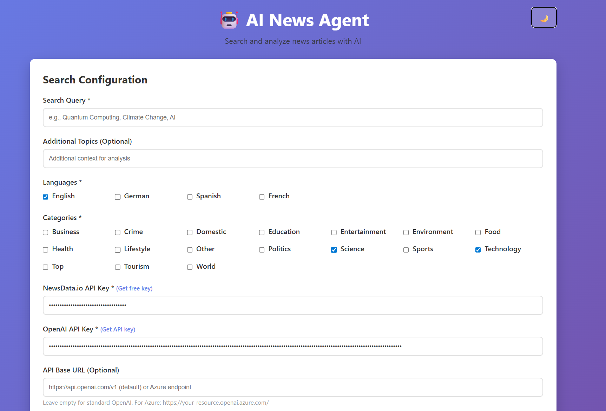

# 🤖 AI News Agent

[](https://railway.app/new/template?template=https://github.com/Jutop/OpenNewsAgent)

Modern web application for searching and analyzing news articles with AI-powered classification.

> **🚀 Live Demo:** [https://opennewsagent-production.up.railway.app](https://opennewsagent-production.up.railway.app)

## 📸 Demo



## ✨ Features

- 🔍 **Search Any Topic** - Search for any news topic across 17+ categories
- 🤖 **AI Classification** - Automatic analysis with OpenAI (gpt-4o-mini)
- 🌍 **17 News Categories** - Business, Technology, Sports, Health, and more
- 📊 **Export Options** - Download results as JSON, CSV, or Excel
- 🌙 **Dark Mode** - Toggle between light and dark themes
- 📜 **Search History** - View the 50 most recent searches (shared across users)
- ⚡ **Real-Time Updates** - Live progress tracking with status updates
- 🔧 **Custom API Settings** - Support for Azure OpenAI and custom base URLs
- 🚀 **Multi-User Ready** - Each user provides their own API keys

## 🚀 Quick Start

### 1. Install Dependencies

```bash
pip install -r requirements.txt
```

### 2. Run the Application

```bash
python main.py
```

Then open: **http://localhost:8000**

### 3. Enter Your API Keys

You'll need two API keys (entered in the browser UI):

1. **NewsData.io** - [Get free key](https://newsdata.io/) (200 requests/day)
2. **OpenAI** - [Get API key](https://platform.openai.com/api-keys)

*Your keys are stored only in your browser's localStorage and never on the server.*

## 📖 How to Use

1. **Enter API Keys** - Add your NewsData.io and OpenAI keys
2. **Search Query** - Enter any topic (e.g., "Quantum Computing", "Climate Change")
3. **Configure Filters** - Select language, country, and category (optional)
4. **Analyze** - Click "Search & Analyze" and watch real-time progress
5. **View Results** - Browse classified articles with AI insights
6. **Export** - Download results in your preferred format

## 🏗️ Architecture

```
OpenNewsAgent/
├── main.py                 # FastAPI application entry point
├── config.py               # Application configuration
├── models.py               # Pydantic data models
├── services/
│   ├── news_fetcher.py     # NewsData.io API integration
│   ├── ai_analyzer.py      # OpenAI classification service
│   └── job_manager.py      # Job state management
├── static/
│   └── index.html          # Single-page web UI
├── results/                # Job results storage (JSON files)
└── requirements.txt        # Python dependencies
```

## 🔑 API Keys & Privacy

- ✅ **No Server Storage** - API keys are only stored in your browser
- ✅ **Per-Request** - Keys are sent with each request, never persisted
- ✅ **Multi-User** - Each user provides their own keys
- ✅ **Your Cost** - You pay for your own OpenAI/NewsData.io usage

## 📊 Categories Available

**17 News Categories:**
- Top Stories
- Business
- Entertainment
- Environment
- Food
- Health
- Politics
- Science
- Sports
- Technology
- Tourism
- World
- Crime
- Domestic
- Education
- Lifestyle
- Other

## 🌐 Supported Languages & Countries

- **Languages**: English, German, Spanish, French, Italian, and more
- **Countries**: US, UK, Germany, France, and 50+ others

## 🔧 Advanced Configuration

### Custom OpenAI Endpoint

Support for **Azure OpenAI** or **custom OpenAI-compatible endpoints**:

1. **Standard OpenAI (default)**:
   - Leave "API Base URL" empty
   - Uses `https://api.openai.com/v1`

2. **Azure OpenAI**:
   - Enter your Azure OpenAI base URL (e.g., `https://your-resource.openai.azure.com/openai`)
   - Check ✅ **"This is an Azure OpenAI endpoint"**
   - Set API Version (e.g `2024-10-21`)
   - Enter your Azure API key
   - Use your **deployment name** as the model (not the base model name)

3. **Custom Endpoints**:
   - Enter your custom base URL
   - Keep Azure checkbox unchecked for OpenAI-compatible APIs

### Rate Limits (Free Tier)

- **NewsData.io**: 200 API calls/day
- **OpenAI**: Varies by account (pay-as-you-go)

## 📝 API Documentation

Interactive API docs available at: **http://localhost:8000/api/docs**

### Main Endpoints:
- `POST /api/search` - Start a new search job
- `GET /api/jobs` - List recent jobs (limit: 50)
- `GET /api/jobs/{job_id}` - Get job details
- `GET /api/jobs/{job_id}/results` - Get analysis results
- `GET /api/jobs/{job_id}/download` - Download results (JSON/CSV/Excel)

No database required - stores results as JSON files.

## 🚀 Deployment

### Deploy to Railway (Recommended - 2 minutes)

1. **Click the Deploy Button:**
   
   [](https://railway.app/new/template?template=https://github.com/Jutop/OpenNewsAgent)

2. **That's it!** Railway will:
   - Clone your repository
   - Install dependencies automatically
   - Deploy your app
   - Give you a live URL

**Cost:** Free ($5/month credit, enough for moderate usage)

### Alternative: Deploy Manually

Or connect your repo manually:
1. Go to [railway.app](https://railway.app)
2. Sign in with GitHub
3. Click "New Project" → "Deploy from GitHub repo"
4. Select `Jutop/OpenNewsAgent`
5. Railway auto-detects Python and deploys

**After deployment**, users can access your app and enter their own API keys!

## 🛠️ Tech Stack

- **Backend**: FastAPI 0.124.4 (async Python)
- **AI**: OpenAI 2.11.0 (AsyncOpenAI)
- **News API**: NewsData.io
- **Data Export**: Pandas 2.3.3, openpyxl
- **Web Server**: Uvicorn 0.38.0
- **Frontend**: Vanilla JavaScript (no framework)

## 📄 License

MIT License - see [LICENSE](LICENSE) file for details.

